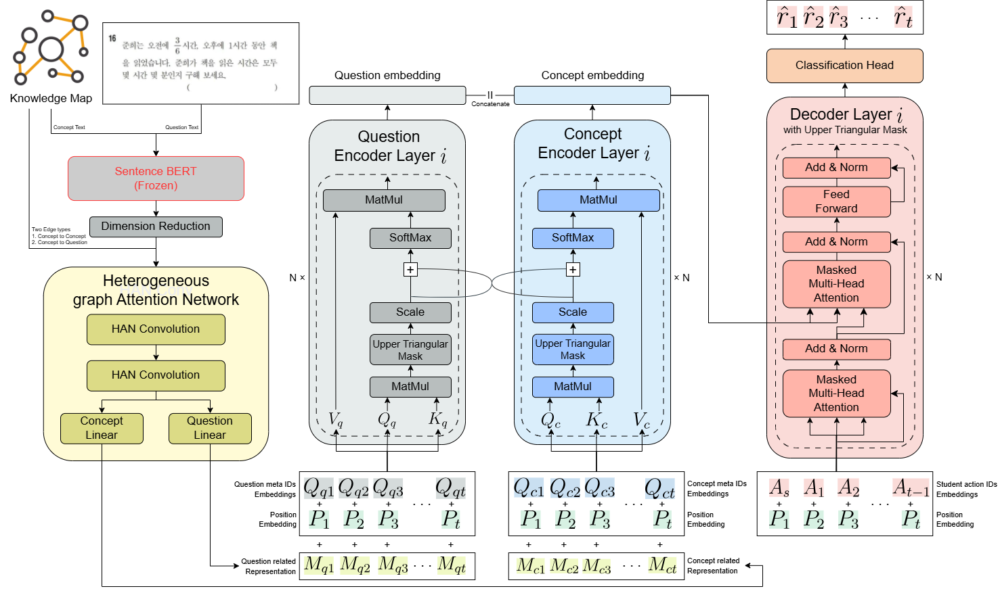

# PICKT: Practical Interlinked Concept Knowledge Tracing for Personalized Learning using Knowledge Map Concept Relations



<br>

## Introduction
ChunJae Customed Knowledge Tracing Model PICKT: train/valid/test/pred modules <br>
성취도 진단부터 맞춤 학습 추천 시스템까지 핵심 모델로 활용되는 천재 전용 KT 모델의 학습/검증/테스트/예측 모듈입니다. <br>
논문 작성을 위해 기존 KT 모델들을 학습 및 평가하는 코드를 추가하였습니다. <br>
기존 KT 는 `["DKT", "DKVMN", "SAKT", "GKT", "AKT", "SAINT+", "DTransformer"]` 가 있습니다.

<br>

## Installation

모듈은 git clone 을 통해 설치하세요.

```console
git clone https://github.com/wonbeeny/PICKT.git
cd PICKT
pip install .
```

<br>


##### Create wheel file <br>

git issue 를 통해 문의 및 이슈 사항을 전달해주시면 수정 후 버전 업데이트를 진행하겠습니다.

```console
python setup.py bdist_wheel
python setup.py sdist bdist_wheel
```

<br>

## Requirements
본 코드는 아래 환경에서 개발했습니다.
- CUDA Version: 12.4
- Driver Version: 550.163.01
- Python=3.10.16

yaml 파일을 통해 conda environment 를 생성하고 활성화하세요. <br>
**※ 주의:** PyTorch 버전은 사용하시는 CUDA 및 Driver 버전을 참고하여 별도 설치하세요.

```console
conda env update --name pickt --file requirements/environment.yaml
conda activate pickt
```

<br>

또는 직접 가상환경을 생성하고 필요한 패키티를 requirements.txt 통해 설치해주세요. <br>
python version 은 3.10.16 을 추천합니다.

```console
conda create -n <your_env_name> python==<python_version> -y
conda activate <your_env_name>
pip install -r ./requirements/requirements.txt
```

<br>

## Getting started

PICKT 모듈을 install 한 뒤 진행하세요.

### Preprocess
모델 학습/검증/추론을 위해서는 아래와 같은 파일들이 필요합니다. <br>
`data/DBE-KT22/preprocessed` 경로에 있는 예시를 확인한 뒤 해당 형태와 같이 데이터를 생성하세요. <br>
`src/pickt/preprocessor/preprocess_dbekt22` 경로에 있는 전처리 코드를 참고하세요. 

| Index | **데이터 이름** | **설명** | **생성을 위한 참고 script** |
| --- | --- | --- | --- |
| 1.  | data_args.json     | 데이터셋 arguments    | dbekt22_data_args.py |
| 2.  | km_data.json       | 전처리된 지식맵 데이터 | dbekt22_embeddings.py <br> dbekt22_dim_reduction.py <br> dbekt22_km_data.py |
| 3.  | train_dataset.json | 학습 데이터셋          | dbekt22_preprocess.py <br> dbekt22_split_datasets.py  |
| 4.  | valid_dataset.json | 검증 데이터셋          | 위와 동일  |
| 5.  | test_dataset.json  | 테스트 데이터셋        | 위와 동일  |
| 6.  | pred_dataset.json  | 예측 데이터셋          | 위와 동일  |


### Worker

예시 코드입니다.

###### Train
```bash
sh ./PICKT/examples/main/train.sh
```

###### Validation
```bash
sh ./PICKT/examples/main/valid.sh
```

###### Test
```bash
sh ./PICKT/examples/main/test.sh
```

###### Predict
```bash
sh ./PICKT/examples/main/pred.sh
```

<br>

## License

This project is licensed under the **Creative Commons Attribution-NonCommercial 4.0 International (CC BY-NC 4.0)**.

###### 🟢 이용 가능 (Permitted)
- **연구 및 교육:** 학술적 연구, 개인적 학습, 학교 수업 등 비영리적 목적으로 자유롭게 사용 가능합니다.
- **수정 및 배포:** 저작자를 표시한다는 조건하에 코드를 수정하거나 재배포할 수 있습니다.

###### 🔴 이용 제한 (Restricted)
- **상업적 이용 금지 (Non-Commercial):** 이 프로젝트를 직접 판매하거나, 본 프로젝트가 포함된 서비스를 유료로 제공하는 등 영리 목적으로 사용하는 것을 엄격히 금지합니다.
- **상업적 이용 문의:** 상업적 이용이 필요한 경우 별도의 라이선스 협의가 필요합니다.

---
Copyright (c) 2025 이원빈 (Lee WonBeen)

<br>

## Citation
```bibtex
@article{lee2025pickt,
  title={PICKT: Practical Interlinked Concept Knowledge Tracing for Personalized Learning using Knowledge Map Concept Relations},
  author={Lee, Wonbeen and Lee, Channyoung and Sohn, Junho and Cho, Hansam},
  journal={arXiv preprint arXiv:2512.07179},
  year={2025}
}
```
