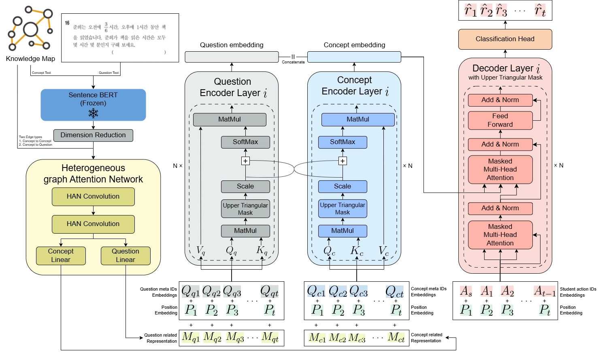

# PICKT: **P**ractical **I**ntegrated **C**ross-consistent **K**nowledge Tracing



PICKT is a practical Knowledge Tracing (KT) model for Intelligent Tutoring System (ITS) services. The model estimates learners' knowledge states by integrating diverse educational signals while preserving the characteristics of each variable.


## Motivation

Knowledge Tracing models often degrade when they encounter **new-question cold start** conditions, where newly introduced items have limited or no historical interaction data. PICKT is designed to improve robustness under this realistic setting by encoding multiple sources of information rather than relying only on question-level interaction history. <br><br>

This design is especially relevant for real-world ITS platforms where:

- new questions are continuously added,
- learner interaction histories are sparse for some items, and
- prediction models must remain stable under operational constraints.


## Reproducibility

To reproduce the **RQ2. Cold Start** experiments, follow the steps below.

#### Prerequisites

RQ2 requires a model that has already been trained for **RQ1**.

Before running RQ2, make sure you have:
- an RQ1-trained model checkpoint,
- `data_args.json` and `km_data.json`.

The `data_args.json` and `km_data.json` files must be stored under `./PICKT/data/Online` and must be identical to those used for RQ1 model training.

#### Reinstall the package

To apply the code changes in this branch, reinstall PICKT from the current branch:

```bash
pip install .
```

The main branch-specific modification for RQ2 is in:

- `./PICKT/src/pickt/preprocessor/milkt_dataset.py`

#### Prepare cold start data

Preprocess the cold start data by running:

```bash
sh ./PICKT/examples/preprocess/Offline/all_run.sh
```

After preprocessing, proceed with model inference.

#### Run inference

1. Check the YAML configuration files under `./PICKT/examples/config/Offline` and select the desired model.
2. Make sure the model checkpoint path is correctly set, since the selected configuration may require a different checkpoint.
3. Update `./PICKT/examples/main/pred.sh` to point to the selected YAML file.
4. Run:
   ```bash
   sh ./PICKT/examples/main/pred.sh
   ```

This will run prediction for the RQ2 setting.

#### Evaluate performance

To evaluate model performance for the cold start setting, use the following notebook:

- `./PICKT/data/Offline/eval2cold_start.ipynb`


## Citation

If this repository is useful for your research, please use a repository citation for now.

```bibtex
@misc{pickt_code,
  title={PICKT: Practical Integrated Cross-consistent Knowledge Tracing},
  author={Anonymous},
  year={2026},
  howpublished={GitHub repository},
  note={Code release for the manuscript "Enhancing Knowledge Tracing Robustness for New Question Cold Start in Intelligent Tutoring Systems" under review}
}
```

After the review process, the citation information will be updated with the final bibliographic record if the paper is accepted.


## License

This repository is released under the **Creative Commons Attribution-NonCommercial 4.0 International (CC BY‑NC 4.0)** license.  <br>
You are free to share and adapt the code for non‑commercial purposes, provided you give appropriate credit to the original work. <br>

[](https://creativecommons.org/licenses/by-nc/4.0/)

Under this license:

- You must **clearly credit the original authors and dataset** whenever you use, share, or modify the data.  
- You may use and redistribute this dataset for **non‑commercial** purposes, including research, education, and internal evaluation.  
- **Commercial use, resale, sublicensing, or embedding in paid products is not allowed** without prior written permission from the dataset owner.  
- Any modifications to the data should be clearly marked as such and not suggest that the original authors endorse your use.

For more details, see the official license deed:

- https://creativecommons.org/licenses/by-nc/4.0/
